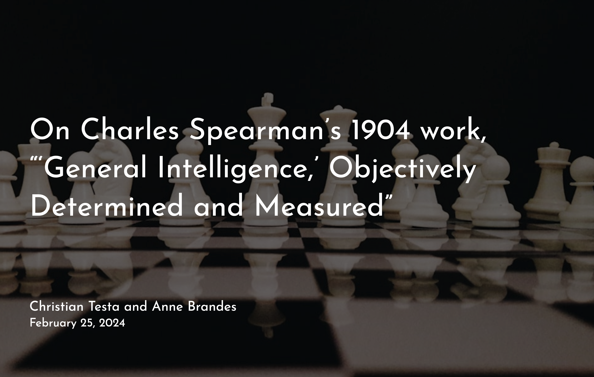

# Slides on Charles Spearman's 1904 paper introducing factor analysis

Brief Description: 

Spearman introduced his theory of "General Intelligence" at the same time as 
he did what is widely considered the first factor analysis in his 1904. 

Spearman's work was pioneering and yet often problematic. He later posited that
"general intelligence" was something physically real and he advanced eugenic
ideas including that the state should prevent some from being able to have
children if they were not above some intelligence threshold. He leaps to 
rather extraordinary conclusions from his data analysis. 

This presentation is a brief overview of the paper and the ideas it introduced. 
Some references that discuss the work are included and alluded to.

Apologies that many of the screenshots are not very accessible. I'd love to find 
a way to make them so. 

The slides are available at [https://ctesta01.github.io/spearman_1904/](https://ctesta01.github.io/spearman_1904/)

